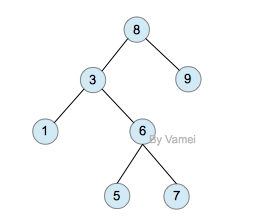
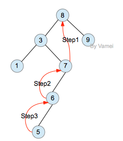
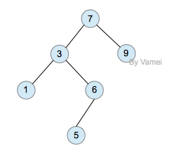

##算法

###查找

---------

####静态查找

* 二分查找
 
	1.二分查找的时间复杂度是O(log(n)),最坏情况下的时间复杂度是O(log(n))
	
	2.二分查找的一个条件是待查询的数组是有序的。
	
	3.二分查找的主要思路是：
	
	* n个对象从小到大存放在有序顺序表ST中，k为给定值。
	* 设low、high指向待查元素所在区间的下界、上界，即low=1,high=n
	* 设mid指向待查区间的中点，即mid=(low+high)/2û让k与mid指向的记录比较
	* 若k=ST[mid].key，查找成功，结束
	* 若k<ST[mid].key，则high=mid-1 [上半区间]
	* 若k>ST[mid].key，则low=mid+1 [下半区间]
	* 重复3,4操作，直至low>high时，查找失败。

	4.代码

		int Binary(int *r,int len,int key)
		{
		 int l,h,mid;
		 l=1;
		 h=len;
		 while(l<=h)
		 {
		  mid=(l+h)/2;
		  if(r[mid]==key)
		   return mid;
		  else if(r[mid]<key)
		            l=mid+1;
		  else
		   h=mid-1;
		 }
		 return -1;
		}

###动态查找

#### 二叉排序树：每个节点都不比它左子树的任意元素小，而且不比它的右子树的任意元素大。

	二叉搜索树可以方便的实现搜索算法。在搜索元素x的时候，我们可以将x和根节点比较:

	1. 如果x等于根节点，那么找到x，停止搜索 (终止条件)
	
	2. 如果x小于根节点，那么搜索左子树
	
	3. 如果x大于根节点，那么搜索右子树
	
* 节点的删除
	
	删除节点相对比较复杂。删除节点后，有时需要进行一定的调整，以恢复二叉搜索树的性质(每个节点都不比它左子树的任意元素小，而且不比它的右子树的任意元素大)。

	* 叶节点可以直接删除。
	* 删除非叶节点时，比如下图中的节点8，我们可以删除左子树中最大的元素(或者右树中最大的元素)，用删除的节点来补充元素8产生的空缺。但该元素可能也不是叶节点，所以它所产生的空缺需要其他元素补充…… 直到最后删除一个叶节点。上述过程可以递归实现。 

#### AVL，平衡二叉树

在AVL树中任何节点的两个儿子子树的高度最大差别为一，所以它也被称为高度平衡树。查找、插入和删除在平均和最坏情况下都是O（log n）。增加和删除可能需要通过一次或多次树旋转来重新平衡这个树。

**这些都是提高了，有空的话就看一下**[链接](http://blog.csdn.net/bingjing12345/article/details/7830474)。

#### 红黑树

红黑树是每个节点都带有颜色属性的二叉查找树，颜色或红色或黑色。在二叉查找树强制一般要求以外，对于任何有效的红黑树我们增加了如下的额外要求:

性质1. 节点是红色或黑色。

性质2. 根节点是黑色。

性质3 每个叶节点（NIL节点，空节点）是黑色的。

性质4 每个红色节点的两个子节点都是黑色。(从每个叶子到根的所有路径上不能有两个连续的红色节点)

性质5. 从任一节点到其每个叶子的所有路径都包含相同数目的黑色节点。

**这五个性质保证了，最长节点路径的长度比最短的长度不超过2倍。这比AVL不超过1的要求低的多。**

####二叉搜索树、AVL、红黑树的比较
* 二叉搜索树：没有任何其他性质限制，容易出现二叉树退化成链表的情况，导致查找、插入、删除效率退化成O(n)
* AVL:有左右子树高度平衡的性质限制，插入，查找，删除最坏的情况都是O(log n)
* 红黑树：没有AVL的高度平衡的限制，没有它那么完美。但正因为没有这么强制的限制，查找效率最好情况下时间复杂度为O(logN)，但在最坏情况下比AVL要差一些，但也远远好于二叉搜索树。而且，插入和删除时需要改变平衡性的概率比AVL低，所以，红黑树的统计特性比AVL要好。

#### B-树
#### B+树

