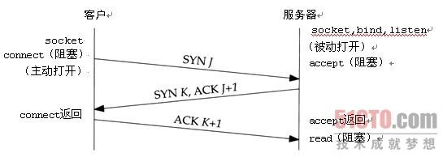
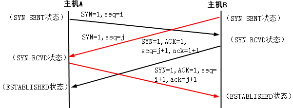
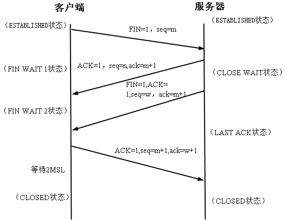
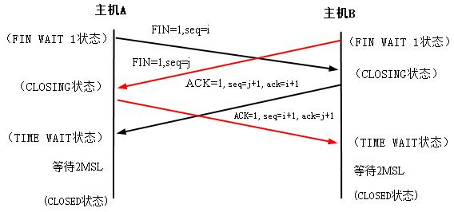
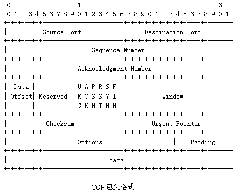

##七层ISO
* 物理层：物理信号
* 链路层：有数据啦
* 网络层：数据知道传输的方向啦；IP，ICMP（death、攻击）
* 传输层：数据加上一些头部后可以用不同方式传输啦；TCP/IP,UDP
* 会话层：知道数据从什么地方开始和结束啦（不能什么都接收吧）；rpc
* 表示层：数据传来了怎么讲2进制编码|加密成一定格式，便于上层解析展示；定义数据格式+加密
* 应用层：可以对有意义的数据做处理啦；FTP，SMTP，telnet，http

##TCP/IP四层
* 应用：FTP，SMTP，telnet，http
* 传输：TCP
* 网络互连:IP
* 网络接口：以太网，wifi。。。

##TCP

###状态字

* 其他的比较熟悉就不列举了，举出CLOSING在双方同时释放连接时才出现的状态
* CLOSING：等待远程TCP对连接中断的确认

###建立连接

------

###三次握手

* 客户端发起连接变成SYN_SEND状态
* 服务端接受连接请求返回确认报文，从LISTEN变成SYN_RCVD状态
* 客户端接受确认报文返回确认报文，自身变为ESTABLISHED
* 服务端收到确认后，变成ESTABLISHED
* 

####为什么是三次握手？
“已失效的连接请求报文段”的产生在这样一种情况下：client发出的第一个连接请求报文段并没有丢失，而是在某个网络结点长时间的滞留了，以致延误到连接释放以后的某个时间才到达server。本来这是一个早已失效的报文段。但server收到此失效的连接请求报文段后，就误认为是client再次发出的一个新的连接请求。于是就向client发出确认报文段，同意建立连接。假设不采用“三次握手”，那么只要server发出确认，新的连接就建立了。由于现在client并没有发出建立连接的请求，因此不会理睬server的确认，也不会向server发送数据。但server却以为新的运输连接已经建立，并一直等待client发来数据。这样，server的很多资源就白白浪费掉了。采用“三次握手”的办法可以防止上述现象发生。例如刚才那种情况，client不会向server的确认发出确认。server由于收不到确认，就知道client并没有要求建立连接。

###四次握手（同时建立连接）

* 双方同时发起连接，虽然发生碰撞，但是只会建立一个连接
* 双方都可能是服务器或客户端：最终双方在同一个连接上都达到ESTABLISED状态
* 双方都经过SYN_SEND-->SYN_RCVD-->ESTABLISHED状态
* 在正常的三次握手中客户端会从SYN_SEND-->发送确认--->ESTABLISHED
* 服务端会从SYN_RCVD-->ESTABLISHED状态
* 因为同时建立连接，双方都从SYN_SEND-->SYN_RCVD，省去了发送确认的步骤
* 

####为什么服务器会保持了大量TIME_WAIT状态

* 可以参考这个[链接](http://blog.csdn.net/shootyou/article/details/6622226/)

这种情况比较常见，一些爬虫服务器或者WEB服务器（如果网管在安装的时候没有做内核参数优化的话）上经常会遇到这个问题，这个问题是怎么产生的呢？
从上面的示意图可以看得出来，TIME_WAIT 是主动关闭连接的一方保持的状态，对于爬虫服务器来说他本身就是“客户端”，在完成一个爬取任务之后，他就会发起主动关闭连接，从而进入TIME_WAIT的状态，然后在保持这个状态2MSL（max segment lifetime）时间之后，彻底关闭回收资源。为什么要这么做？明明就已经主动关闭连接了为啥还要保持资源一段时间呢？这个是TCP/IP的设计者规定的，主要出于以下两个方面的考虑：

* 1.防止上一次连接中的包，迷路后重新出现，被新链接误认为是自己产生的，其实是上一次链接中的包，影响新连接（经过2MSL，上一次连接中所有的重复包都会消失）
* 2.可靠的关闭TCP连接。在主动关闭方发送的最后一个 ack(fin) ，有可能丢失，这时被动方会重新发fin, 如果这时主动方处于 CLOSED 状态 ，就会响应 rst 而不是 ack。所以主动方要处于 TIME_WAIT 状态，而不能是 CLOSED 。另外这么设计TIME_WAIT 会定时的回收资源，并不会占用很大资源的，除非短时间内接受大量请求或者受到攻击。

* 解决办法：优化内核参数，可以不知道优化哪些参数，知道朝什么方向优化就可以了

####为什么服务器保持了大量CLOSE_WAIT状态
* TIME_WAIT状态可以通过优化服务器参数得到解决，因为发生TIME_WAIT的情况是服务器自己可控的，要么就是对方连接的异常，要么就是自己没有迅速回收资源，总之不是由于自己程序错误导致的。
* CLOSE_WAIT就不一样了，从上面的图可以看出来，如果一直保持在CLOSE_WAIT状态，那么只有一种情况，就是在对方关闭连接之后服务器程序自己没有进一步发出ack信号。换句话说，就是在对方连接关闭之后，程序里没有检测到，或者程序压根就忘记了这个时候需要关闭连接，于是这个资源就一直被程序占着。个人觉得这种情况，通过服务器内核参数也没办法解决，服务器对于程序抢占的资源没有主动回收的权利，除非终止程序运行。
* 解决办法：检查并修复程序中的bug

###断开连接

------

###四次挥手

* 客户端发起释放连接请求，发送FIN报文给服务端，变为FINAL_WAIT1
* 服务端接受请求，发送确认报文，变为CLOSE_WAIT,通知应用程序客户端已无数据传输
* 客户端收到确认变为 FINAL_WAIT2
* 服务端发送完所有数据后，发送释放连接请求FIN报文给客户端，变为LAST_ACK
* 客户端收到FIN后，发送确认ACK，变为TIME_WAIT
* 服务端收到确认后，变为CLOSED
* 客户端等等2MSL变为CLOSED
* 

###同时断开（数据同时传完断开连接）

* 同时断开的场景和同时建立连接类似，双方都有可能是服务或客户端。当双方的数据同时传输完毕就会同时执行连接的释放操作
* 与四次挥手不同的是无CLOSE_WAIT而是CLOSING状态
* 开始双方都发送FIN，变为FINAL_WAIT1
* 双方都接到释放连接后变为CLOSING，并发送确认报文
* 双方进入TIME_WAIT，等2MSL后，进入CLOSED状态
* 

-------

###标志位

* SYN：建立连接
* FIN：释放连接
* ACK：确认，为1表确认号（ack合法），为0则忽略确认号字段
* RST：重置连接，在FIN后出现
* PSH：接受到的全部数据立即送往应用程序处理
* URG：紧急指针字段值有效，[seq,seq+urg]范围的字节都为紧急数据，紧急位以外的全部放到缓存区域

* 几个标志位出现的关系：
	* ACK和SYN，FIN：可以一起出现，单独SYN表示开始建立连接；SYN+ACK表示同意建立连接
	* RST和FIN：出现在FIN后，表示连接重置
	* PSH为1表示DATA有值 

------

##TCP和UDP的比较

* tcp：面向连接，有流量控制、拥塞控制，是面向字节流的传输协议
* udp：无连接，面向报文，无控制手段，不保证报文能正确传到目标机器
* tcp适合对效率要求较低，但准确性较高的场景；udp与之相反
* tcp是点对点的链接，不能完成广播、组播、多播；这点udp可以实现

###TCP如何保证数据包的可靠性

* 发送方缓存发送的数据，并未数据设置超时定时器
* 超时前收到确认，释放数据缓冲区；否则重传该数据直至超过最大次数
* 接收方接受数据先crc校验，再交由上层处理，然后返回累计应答报文，表明收到数据。若接收方也有数据给接收方也可以一起发送。（**快重传时，只要收到失序报文就立即发送重复确认包，ACK=1**）

###拥塞控制
* 慢启动：从1开始成倍增加发送窗口（cwnd），直至大于慢启动门限值（sThreshold）进入拥塞避免算法

* 拥塞避免：cwnd线性增长每次+1，出现拥塞时sThreshold=max(2,cwnd/2),cwnd=1;

* 快恢复：发送方收到3个重复确认后执行乘法减小，sThreshold减半预防网络拥塞，但不执行慢开始，因为此时网络不一定出现拥塞。cwnd=sThreshold=cwnd/2后开始拥塞避免

* 快重传：
	* 算法要求发送方只有连续收到3个重复确认就立即重传丢失的报文，不必等待该报文超时
	* 接收方收到一个失序报文就立即发送重复确认
	
###流量控制

* 如果发送方发送速率太快，接收方可能来不及接受，造成数据丢失
* 流量控制就是让发送方的速率不能太快，要让接收方来得及接受

* 滑动窗口协议：解决传输速率+流量控制问题
	* 报文一个个发送太慢，太快对方接受不了。滑动窗口规定在此窗口中的数据可以一起发送。

###两者的比较

* 拥塞控制：防止过度数据注入到网络中，是全局性的控制过程，涉及所有降低网络传输性能的因素
* 流量控制：端到端的通信数据量的控制，控制发送方的发送速率以便接收方来得及接受

##DNS解析过程

* DNS域名服务系统，保持了域名与IP地址的映射关系
* 查询过程：
	* 主机查询本地域名服务器是**递归查询**：交给他后就直接等结果了
	* 本地域名服务器到根域名等服务器中查询是迭代查询：他拿到中间结果再挨个查找
	* hosts文件-->本地域名服务缓存-->本地域名服务器--->根域名服务器--->顶级域名服务器
	* --->写入本地域名服务器缓存-->写入本地域名服务缓存--->ip返回给查询主机